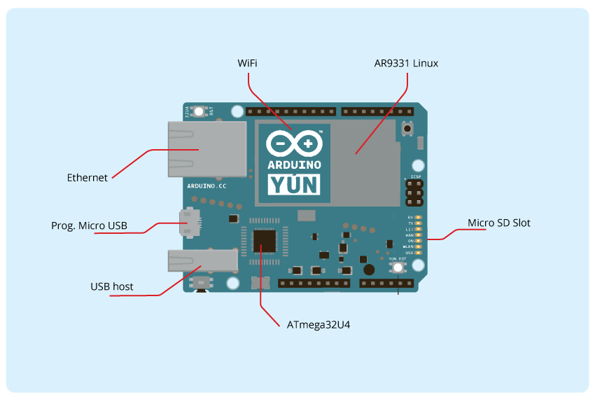
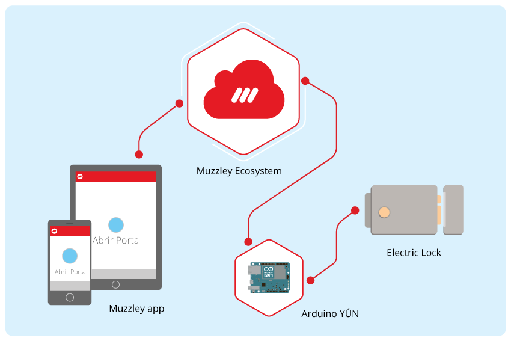

# Arduino YÚN Muzzley Lock #

For one or other reason, all of us have wished to remotely open our door to someone we trust and there was no way to do it. Or committed the most common mistake of leaving the keyring behind when closing our door…

If you wish to hack your electric door lock and be able to unlock it through your smartphone, this is the time to embrace a very simple project where you will only need a solid-state relay to act on the lock, an Arduino YÚN to provide the WiFi connection, some simple wiring and Muzzley app!

Muzzley is a cloud based app that gathers all of your connected devices and puts them to work together in an intuitive way.
The app allows connected devices of different brands to communicate with and respond to each other. This not only brings more value to the majority of consumers who are still figuring out the value of the smart home, but also to the brands we integrate with.

Some of the brands that work with us: Philips Hue Lamp, Nest Learning Thermostat®, Nest Protect: Smoke + Carbon Monoxide™, Rachio Smart Sprinkler and Koubachi Wi-Fi Plant Sensor.

Alongside this, we're working on a machine learning algorithm that will make these devices more intuitive and customized than ever. Because we believe that people have better things to do than to automate their devices, our goal is to create an ecosystem that adapts to the user's patterns and behaviors.

Muzzley is available in iOS, Android and Windows Phone.
More info about Muzzley: https://www.muzzley.com

f: /muzzleypower

t: @muzzleypower

# What is Arduino Ciao?

Arduino Ciao is a easy-to-use and powerful technology that enables Arduino sketches to communicate intuitively with the "outside World". It aims to simplify interaction between microcontroller and Linino OS  allowing a variety of connections with most common protocols, third-party services and social networks.

Ciao has been designed and developed to be modular and easily configurable. Its goal is to support several connectors capable of interacting with system resources (filesystem, console, memory) and to communicate with the most common and useful protocols (XMPP, HTTP, WebSocket, COAP, etc..) and applications (Jabber, WeChat, Twitter, Facebook, etc.).

It only needs the Ciao Library running on the MCU (microcontroller) side to interact with your Arduino sketch code, and the Ciao Core running over the Linino OS to enable the communication with several modules called connectors.

More info about Arduino Ciao: [http://labs.arduino.org/ciao](http://labs.arduino.org/ciao)

# How to wire the lock to the Arduino?

The image below shows the wiring needed to connect the lock to the Arduino board:

## Install the Muzzley Connector and Create your Muzzley Arduino Lock App

1) Download the project from the following [url](https://github.com/muzzley/arduino-ciao-muzzley-connector)

2) Login on our [developers website](https://www.muzzley.com/developers) (or create a new account) and open the Apps page.

3) Follow the included set up instructions from the [arduino-ciao-muzzley-connector](https://github.com/muzzley/arduino-ciao-muzzley-connector) repository and use widget code and the profile spec configuration file provided on this example, right next to the doorlock.ino file.

## Upload the Arduino Sketch

1) Connect the Arduino USB port to the computer, if not already connected, and open the Arduino IDE.

2) Open the doorlock.ino sketch, compile it, select the correct serial port and finally upload it to the Arduino board.

3) Check the video [here](https://www.youtube.com/watch?v=r1HL9QZI-as), and Enjoy! :)

